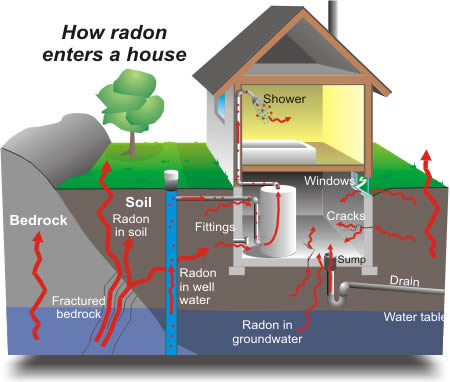
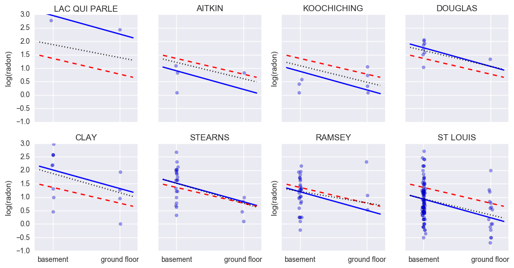
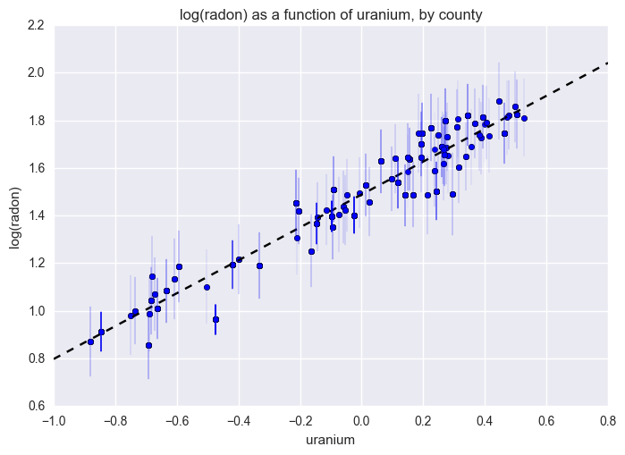

# README.md Teaching-Stan-Hierarchical-Modelling

# Introduction

This set of notebooks works through an example of *hierarchical* (also known as *multilevel*) Bayesian modelling using the `pystan` Python module. It is derived from Chris Fonnesbeck's introduction to Bayesian multilevel modelling using Stan:

* [Chris Fonnesbeck's primer](http://mc-stan.org/users/documentation/case-studies/radon.html)
* [Stan homepage](http://mc-stan.org/)





# Reading/Using the Notebooks

These notebooks can be read through online as webpages (follow the links below in [`Notebooks`](#notebooks)), or downloaded and used interactively as [Jupyter](https://jupyter.org/) notebooks, where you can explore and experiment with the models in your web browser, using Python.

# License Information

Chris Fonnesbeck's material is licensed under the following licenses:

* Text: [CC-BY version 3.0](https://creativecommons.org/licenses/by/3.0/)
* Code: [Apache version 2.0](https://www.apache.org/licenses/LICENSE-2.0)

Both licences grant permission to reproduce and prepare derivative works, and these licenses should be considered also to apply to the work in this repository.

# Reporting Issues

I will have made mistakes. If you spot any, or would otherwise like to make improvements, I would be grateful if you could please take one of the following actions:

* Raise the issue at the [GitHub issues page](https://github.com/widdowquinn/Teaching-Stan-Hierarchical-Modelling/issues) for this repository.
* Fork the repository, make the required changes, and then issue a pull request.

<a name="notebooks" />
# Notebooks

1. [Introduction](01-Introduction.html)
2. [Data Import](02-Data_Import.html)
3. [Bias/Variance Tradeoff](03-bias_variance_tradeoff.html)
4. [A Pooled Model](04-pooled_model.html)
5. [An Unpooled Model](05-unpooled_model.html)
6. [Pooled vs Unpooled Models](06-pooled_vs_unpooled.html)
7. [Partial Pooling - An Introduction](07-partial_pooling_intro.html)
8. [Partial Pooling - Varying Intercept](08-partial_pooling_varying_intercept.html)
9. [Partial Pooling - Varying Slope](09-partial_pooling_varying_slope.html)
10. [Partial Pooling - Varying Intercept and Slope](10-partial_pooling_varying_slope_and_intercept.html)
11. [Group-level Predictors](11-group_level_predictors.html)
12. [Contextual Effects](12-contextual_effects.html)
13. [Prediction](13-prediction.html)


# Getting Started with Interactive Notebooks


## 1. Get the notebooks

Clone the notebooks from GitHub with:

```bash
git clone git@github.com:widdowquinn/Teaching-Stan-Hierarchical-Modelling.git
```

Then change into the repository directory:

```bash
cd Teaching-Stan-Hierarchical-Modelling/
```


## 2. Create a `virtualenv` to run the notebooks

Using `virtualenv` we create a standalone Python virtual environment with the appropriate libraries installed. This will not interfere with system Python or any other Python instances available on your machine.

First, create the virtual environment:

```bash
virtualenv -p python3.6 venv-stan
```

Next, activate the virtual environment:

```bash
source venv-stan/bin/activate
```

Then, install the required packages:

```bash
pip install -r requirements.txt
```

Finally, install Jupyter:

```bash
pip install jupyter
```


## 3. Starting the notebooks

To start Jupyter, issue the following at the command line:

```bash
jupyter notebook
```

This should bring up a view on the current directory in your browser. Click on any of the `.ipynb` notebook files to start them running in your browser - the `index.ipynb` page is a good place to start.


